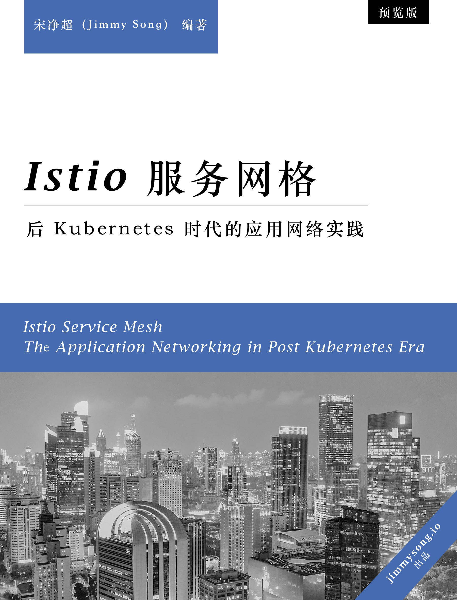

# Istio Handbook——Istio 服务网格进阶实战

[Istio](https://istio.io) 是由 Google、IBM、Lyft 等共同开源的 Service Mesh（服务网格）框架，于2017 年开源。本书作为 [Kubernetes Handbook——Kubernetes 中文指南/云原生应用架构实践手册](https://github.com/rootsongjc/kubernetes-handbook)的姊妹篇，希望读者在了解了 Kubernetes 的基础上阅读。

  

本书的主题包括：

- 服务网格概念解析
- 控制平面和数据平面的原理
- Istio 架构详解
- Istio 进阶实战
- 基于 Istio 的自定义扩展

本书基于 Istio 1.5+ 版本编写，您可以通过以下地址参与到本书的编写或阅读本书：

- GitHub 地址：https://github.com/rootsongjc/istio-handbook
- Gitbook 在线浏览：https://jimmysong.io/istio-handbook/

## 致谢

感谢 [ServiceMesher](https://www.servicemesher.com) 及[云原生社区 Istio SIG](https://i.cloudnative.to/istio/) 先后负责翻译了 [Envoy](https://cloudnative.to/envoy/) 及 [Istio](https://istio.io/latest/zh/) 官方文档，为本书的成书提供了大量参考资料。

## 版权与许可证

本书版权归 Jimmy Song 所有， 您可以使用[署名 - 非商业性使用 - 相同方式共享 4.0 (CC BY-NC-SA 4.0)](https://creativecommons.org/licenses/by-nc-sa/4.0/deed.zh)  协议共享。

## 参与本书

请参考 [Istio 文档样式指南](https://istio.io/latest/about/contribute/style-guide/)。

